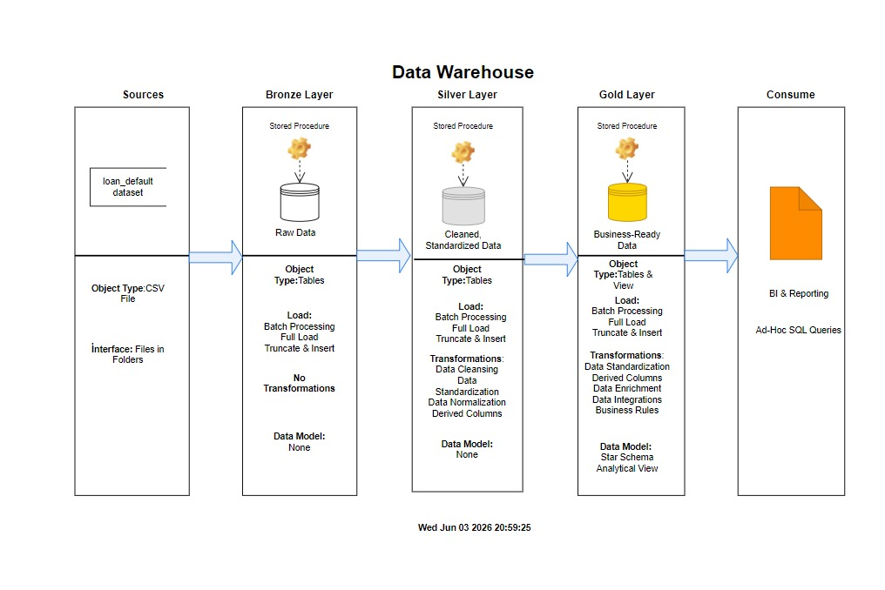

# SQL Loan Risk Data Warehouse

## Data Warehouse Project
This project demonstrates the design and implementation of a modern Data Warehouse solution using PostgreSQL and the Medallion Architecture (Bronze, Silver, and Gold layers).

The project transforms raw loan application data into a business-ready analytical model through a structured ETL process. Data is ingested from CSV files, validated, cleansed, standardized, enriched with business rules, and ultimately modeled into a dimensional star schema optimized for reporting and analytics.

The final Gold Layer consists of dimension tables, a central fact table, and a consolidated analytical view designed to support business intelligence and loan risk analysis use cases.

---

## Data Architecture
This project follows the Medallion Architecture pattern, which organizes data into multiple layers to improve data quality, maintainability, and analytical usability.



### Bronze Layer
The Bronze Layer stores raw data exactly as received from the source system.

**Responsibilities:**
* Raw data ingestion
* Initial storage of source records
* Data preservation
* Basic validation checks

### Silver Layer
The Silver Layer performs data cleansing, standardization, and quality improvements.

**Responsibilities:**
* Data type standardization
* Missing value handling
* Duplicate handling
* Data quality improvements
* Business rule preparation

### Gold Layer
The Gold Layer contains analytics-ready data modeled using a dimensional star schema.

**Responsibilities:**
* Business rule implementation
* Data enrichment
* Dimensional modeling
* Analytical optimization
* Reporting-ready datasets

---

## Project Overview
The project implements a complete end-to-end data warehousing workflow for loan risk analysis.

**Key features include:**
* Layered Medallion Architecture
* Automated ETL pipelines using stored procedures
* Data quality validation checks
* Star schema dimensional modeling
* Surrogate key implementation
* Fact and dimension table design
* Analytical business rule transformations
* Reporting-ready Gold Layer view

**The final model enables efficient analysis of:**
* Customer demographics
* Loan characteristics
* Credit profiles
* Property attributes
* Loan default behavior
* Debt burden segmentation

---

## Project Requirements
The primary objectives of this project were:
* Build a layered Data Warehouse using Medallion Architecture
* Load and manage raw loan application data
* Perform data cleansing and standardization
* Implement business transformation rules
* Design a dimensional star schema
* Create fact and dimension tables
* Ensure data quality through validation checks
* Provide an analytics-ready dataset for downstream reporting and analysis

---

## Repository Structure

```text
SQL-LOAN-RISK-DATA-WAREHOUSE/
│
├── datasets/
│   └── README.md
│
├── docs/
│   ├── data_architecture.jpeg
│   ├── data_catalog.md
│   ├── data_flow.jpeg
│   └── data_model.jpeg
│
├── scripts/
│   ├── bronze/
│   │   ├── bronze_data_quality_checks.sql
│   │   └── ddl_bronze.sql
│   │
│   ├── silver/
│   │   ├── ddl_silver.sql
│   │   ├── proc_load_silver.sql
│   │   └── silver_data_quality_check.sql
│   │
│   ├── gold/
│   │   ├── 01_gold.stg_loan_default.sql
│   │   ├── 02_ddl_gold.sql
│   │   ├── 03_proc_load_gold.sql
│   │   └── 04_loan_default_data_warehouse_view.sql
│   │
│   ├── init_database.sql
│   └── init_schemas.sql
│
├── tests/
│   ├── bronze_data_profiling_and_validation_check.sql
│   └── gold_data_quality_and_consistency_check.sql
│
├── LICENSE
└── README.md
